[](/LICENSE)
[](https://github.com/bcgov/repomountie/blob/master/doc/lifecycle-badges.md)

[](https://github.com/bcgov/nr-rec-resources/actions/workflows/main.yml)
[](https://github.com/bcgov/nr-rec-resources/actions/workflows/analysis.yml)
[](https://github.com/bcgov/nr-rec-resources/actions/workflows/scheduled.yml)

# Recreation Resource Services - RSTBC

- [Contributing](CONTRIBUTING.md)
- [Code of Conduct](CODE_OF_CONDUCT.md)
- [License](LICENSE)
- [Security](SECURITY.md)

## Table of Contents

### Project Setup

- [Local Development](#local-development)
  - [Prerequisites](#prerequisites)
  - [Docker Compose](#docker-compose)
  - [Installing and running the application locally](#installing-and-running-the-application-locally)
  - [Database](#database)
    - [Flyway](#flyway)
    - [Running migrations](#running-migrations)
    - [Migrating RDS Postgres database between AWS environments](docs/database_migration.md#migrating-rds-postgres-database-between-aws-environments)
  - [Backend](#backend)
  - [Frontend](#frontend)
  - [Generate API Client Library](#generate-api-client-library)
    - [Prerequisites](#client-library-prerequisites)
    - [Generate TypeScript Axios Client](#generate-typescript-axios-client)
  - [Generating Prisma Schema and Client](#generating-prisma-schema-and-client)
  - [Shared Library](shared/README.md)
- [Pre-commit hooks](#pre-commit-hooks)
  - [Skipping pre-commit hooks](#skipping-pre-commit-hooks)
  - [Running pre-commit on all files](#running-pre-commit-on-all-files)
- [Style Guide](#style-guide)
- [Schemaspy Database Schema Documentation](#schemaspy-database-schema-documentation)
- [Storybook Integration](#storybook-integration)
- [API Metrics](#api-metrics)

### API

- [OpenAPI/Swagger Documentation](docs/open-api-swagger.md)
  - [Swagger Decorators](docs/open-api-swagger.md#swagger-decorators)
  - [Accessing Generated Documentation](docs/open-api-swagger.md#accessing-generated-documentation)

### CI/CD

- [CI/CD pipeline with GitHub Actions](docs/ci.md#ci-cd-pipeline-with-github-actions)
  - [Docker image build and push](docs/ci.md#docker-image-build-and-push)
  - [Visual Regression Testing with Happo](docs/ci.md#visual-regression-testing)

### Deployment

- [Deploying to AWS](docs/deployment.md#deploying-to-aws)
  - [Manually deploying pull request to AWS](docs/deployment.md#manually-deploying-pull-request-to-aws)
  - [Clearing Terraform state lock](docs/deployment.md#clearing-terraform-state-lock)
  - [AWS Logging](docs/deployment.md#aws-logging)
    - [Cloudwatch](docs/deployment.md#cloudwatch)
    - [API logs](docs/deployment.md#api-logs)
    - [Aurora RDS PostgreSQL logs](docs/deployment.md#aurora-rds-postgresql-logs)
  - [Aurora RDS PostgreSQL Query Editor](docs/deployment.md#aurora-rds-postgresql-query-editor)

### Database

- [Postgresql](docs/postgresql.md)
  - [Metadata columns](docs/postgresql.md#metadata-columns)
  - [History tracking with temporal tables](docs/postgresql.md#history-tracking-with-temporal-tables)

### Testing

- [Playwright](docs/playwright.md)
  - [Running e2e tests](docs/playwright.md#running-e2e-tests)
  - [Writing tests](docs/playwright.md#writing-tests)
    - [POM (Page Object Model)](docs/playwright.md#pom-page-object-model)

## Local Development

### Prerequisites

- Node.js
- npm
- Docker OR PostgreSQL 16
- Flyway

### Docker Compose

To run the entire application using Docker Compose, run the following commands:

```bash
git clone git@github.com:bcgov/nr-rec-resources.git
cd nr-rec-resources
docker-compose up
```

Navigate to `http://localhost:3000` in your web browser to view the application.

### Installing and running the application locally

Before starting development on this project, run `npm install` in the base
directory to install eslint and plugins to ensure linting is working correctly.

### Database

To run this on your local machine, you will need a working installation of
PostgreSQL 16 and Flyway.

#### Flyway

Flyway is a database migration tool that is used to manage the database schema.

To install flyway locally on macOS or Linux, if you have Homebrew installed, you
can run:

```bash
brew install flyway
```

Alternatively you can manually download the latest version of Flyway from the
[Flyway website](https://flywaydb.org/download/).

#### Running migrations

Create an `.env` file in the `backend` directory using the example in
`backend/.env.example` as a template.

```bash
cd nr-rec-resources
make create_db
make migrate
make load_fixtures
```

or to drop, recreate, run migrations and reseed the database, ensure no
connections are open to the database then run:

```bash
make reset_db
```

### Backend

Ensure you have the `.env` file in the `backend` directory from the previous
step.

```bash
cd backend
npm install
npx prisma generate
npm run dev
```

### Frontend

Create an `.env` file in the `frontend` directory using the example in
`frontend/.env.example` as a template.

```bash
cd frontend
npm install
npm run dev
```

Navigate to `http://localhost:3000` in your web browser to view the application.

### Generate API Client Library

#### Client Library Prerequisites

Install Java Development Kit (JDK) 17:

```bash
brew install openjdk@17
```

#### Generate TypeScript Axios Client

Run the following command from the project root folder to generate the
TypeScript client library from your OpenAPI specification and run `prettier-fix`
to format the files:

```bash
npm run install-client-sdk
```

This command will:

- Generate TypeScript client code using Axios
- Use the OpenAPI spec from your local NestJS server which should be running on
  port **8000**
- Output the generated code to `src/service/recreation-resource` directory

### Generating Prisma Schema and Client

When you make changes to the database schema, you will need to regenerate the
Prisma schema and client. Ensure your database is running and run the following
commands:

```bash
cd backend
npx prisma db pull # Pull the latest schema from the database
npx prisma generate # Generate the Prisma client
```

The updated Prisma schema can be viewed in `backend/prisma/schema.prisma`

## Pre-commit hooks

Pre-commit is set up to run checks for linting, formatting, and secrets.

- Install [pre-commit](https://pre-commit.com/)
- With pre-commit installed run `pre-commit install` in the root directory of
  the project
- Pre-commit should now run on your staged files every time you make a commit

### Skipping pre-commit hooks

If you need to skip the pre-commit hooks for a specific commit, you can use the
`--no-verify` flag. Some developers may use this when they are making a commit
that they know will fail the pre-commit checks, but they still want to commit
the changes. This is a perfectly acceptable workflow, though there is a
pre-commit check in CI so it may be necessary to run pre-commit on all files
before putting a PR up for review if this is skipped.

```bash
git commit -m "Your commit message" --no-verify
```

### Running pre-commit on all files

Sometimes it may be necessary to run `pre-commit` on the entire project due to a
mistake or a configuration change.

```bash
pre-commit run --all-files
```

## Style Guide

Commits follow the conventions defined in the
[Conventional Commits](https://www.conventionalcommits.org/en/v1.0.0/)
specification.

## Schemaspy Database Schema Documentation

Schedule job runs every saturday and keep schema documentation upto date in
[github pages](https://bcgov.github.io/nr-rec-resources/).

## Architecture

#### Public App


#### Admin App



## Storybook Integration

This project integrates Storybook for component development and includes MSW
(Mock Service Worker) for API mocking.

### Running Storybook

```bash
npm run storybook
```

### Directory Structure

```
frontend/.storybook/        # Storybook configuration

frontend/stories/          # Component stories - Folder structure mirrors src
├── components
│   └── rec-resource
│       ├── AdditionalFees.stories.ts
│       ├── Camping.stories.ts
│       ├── RecResourcePage.stories.tsx
│       ├── mockData.ts
│       └── mockHandlers.ts
└── mock
    └── mockServiceWorker.js

```

---

## API Metrics

This application uses AWS CloudWatch SDK to automatically capture and report key
performance and usage metrics for API endpoints. This is primarily handled by
the `ApiMetricsInterceptor` located in
`/backend/src/api-metrics/api-metrics.interceptor.ts`.

> ❗❗❗ When running locally make sure to include the environment variable
> `APP_ENV=Local`. This disables the metric emission.

## How it Works

- **Interceptor:** The `ApiMetricsInterceptor` intercepts incoming HTTP requests
  and outgoing responses.
- **Timing:** It measures the latency (duration) of each request.
- **Operation Identification:** `OperationNameUtil` determines the operation
  name, preferring the operationId from `@ApiOperation` if available.
- **Metric Construction:** `ApiMetricsService` constructs metric data points,
  including latency, request count, and error count when applicable.
- **Publishing:** If metrics are enabled (i.e., not running locally),
  MetricsService publishes the metrics to AWS CloudWatch under the namespace
  `RecreationSitesAndTrailsBCAPI`.

### Metrics Captured

For each request, the following metrics are potentially logged:

- **RequestLatency**: The time taken to process the request (Unit:
  Milliseconds).
- **RequestCount**: A count of requests received (Unit: Count).
- **ErrorCount**: A count of requests resulting in a 4xx or 5xx status code
  (Unit: Count).

### Dimensions

Metrics are published with the following dimensions for filtering and
aggregation in CloudWatch:

- **Operation:** Identifies the specific API operation/endpoint being called.
- **Method:** The HTTP request method (e.g., `GET`, `POST`).
- **StatusCode:** The HTTP status code of the response (as a string).

### Setting Up Metrics for a New Operation/Endpoint

The `ApiMetricsInterceptor` needs an `Operation` name to associate the metrics
with a specific endpoint.

1. **[Recommended] Custom Operation Name:** For better clarity or to decouple
   the metric name from potential code refactoring (like renaming a class or
   method), you can set an operation name using Swagger's `@ApiOperation`
   decorator with an `operationId` property on your controller method.
2. **Default Behavior:** If you do _not_ specify an operation name, the
   interceptor will automatically generate one using the format:
   `<ControllerClassName>.<handlerMethodName>`. For example, if you have a
   `getRecreationSiteById` method in a `RecreationResourceController`, the
   default operation name will be
   `RecreationResourceController.getRecreationSiteById`.

### Viewing Metrics

Metrics can be viewed in:

- AWS CloudWatch under the namespace `RecreationSitesAndTrailsBCAPI`
- Filter metrics by dimensions:
  - Operation
  - Method
  - StatusCode

---
