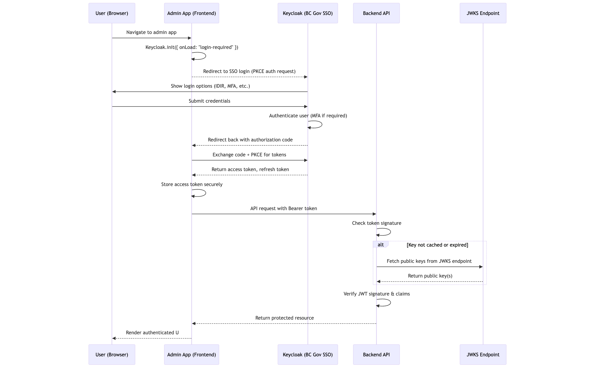

# Authentication & Authorization

The admin interface uses
[BC Gov Common Hosted Single Sign-on (CSS)](https://bcgov.github.io/sso-docs/)
(Keycloak) with a Public Client and PKCE. The frontend handles login, token
refresh, and session-expiry UX; the backend validates JWTs and enforces RBAC.

## Architecture Overview



## Frontend

### App structure

- **AuthProvider** (outermost): exposes auth state and `AuthService` to the app
- **AuthGuard**: shows loading, error, login, unauthorized, or app content (see
  table below)
- **RouterProvider**: only rendered when the user is authenticated and
  authorized

### Configuration

- Keycloak is initialized at startup with server URL, realm, and client ID from
  env
- `check-sso` for silent sign-in when the user is already in BC Gov SSO
- Session check iframe to detect logout in another tab

### Key components

**AuthService** (singleton)

- Wraps Keycloak; exposes `init()`, `login()`, `logout()`, `getToken()`, and
  user/role helpers
- Before `init()`, registers:
  - **onTokenExpired**: calls `updateToken(70)` to refresh in the background; on
    failure dispatches error so the UI shows “Log in again”
  - **onAuthRefreshError**: dispatches error with “Your session has expired.
    Please log in again.”
- Tokens live in memory only (not localStorage or cookies)

**AuthContext / AuthProvider** — holds `user`, `isAuthenticated`,
`isAuthorized`, `isLoading`, `error`, `authService`; subscribes to auth events
and updates state.

**AuthGuard** — chooses what to render based on auth state (see table).

### End-user experience

| State                         | What the user sees                                               |
| ----------------------------- | ---------------------------------------------------------------- |
| Loading                       | Full-screen spinner while auth is initializing.                  |
| Not authenticated             | Login page with button to sign in via BC Gov SSO.                |
| Authenticated, not authorized | “You are not authorized to log in yet.”                          |
| Session / refresh error       | “Authentication error” plus message and **Log in again** button. |
| Authenticated and authorized  | The app; tokens are refreshed in the background.                 |

### Token lifecycle

- **Access token**: 5 min default
  ([BC Gov CSS additional settings](https://bcgov.github.io/sso-docs/integrating-your-application/additional-settings)).
  Sent in `Authorization` header. When it expires, Keycloak fires
  `onTokenExpired` and the app calls `updateToken(70)` to refresh in the
  background.
- **Refresh / session**: 30 min idle default (no successful refresh for 30 min →
  session expired, user sees “Log in again”). 10 hr session max; after that the
  user must sign in again.
- **Logout**: App calls Keycloak logout; user is redirected to SSO logout;
  session and tokens are cleared.

## Backend

- **Stack**: `@nestjs/passport`, `passport-keycloak-bearer`, `passport`
- **Guards**: Protect routes; validate JWT (signature via Keycloak JWKS, issuer,
  audience, expiration); invalid/expired → 401
- **RBAC**: Use `@AuthRoles` with `RolesGuard` to restrict by token roles:

```ts
@UseGuards(AuthGuard('keycloak'), RolesGuard)
@AuthRoles('rst-admin', 'rst-viewer')
@Get('/secure-data')
getSecureData() {
  return 'Protected by role-based access';
}
```

Protected routes: frontend sends Bearer token in `Authorization`; backend
validates it; invalid or expired tokens get 401.

## Environment

**Frontend**

```text
VITE_KEYCLOAK_AUTH_SERVER_URL=<keycloak-server-url>   # e.g. https://dev.loginproxy.gov.bc.ca/auth
VITE_KEYCLOAK_REALM=<realm-name>                      # e.g. standard
VITE_KEYCLOAK_CLIENT_ID=<client-id>
```

**Backend**

```text
KEYCLOAK_REALM_URL=<keycloak-realm-url>
KEYCLOAK_CLIENT_ID=<client-id>
```

## CSS documentation

- [Introduction & overview](https://bcgov.github.io/sso-docs/)
- [Additional settings](https://bcgov.github.io/sso-docs/integrating-your-application/additional-settings)
  — access token lifespan, client session idle/max
- [Client setup without adapter](https://bcgov.github.io/sso-docs/integrating-your-application/settingup-no-adapter)
  — endpoints, OpenID configuration URLs
- [Client setup with an adapter](https://bcgov.github.io/sso-docs/integrating-your-application/settingup-adapter)
- [Installation JSON](https://bcgov.github.io/sso-docs/integrating-your-application/installation-json)
  — understanding the client config file
