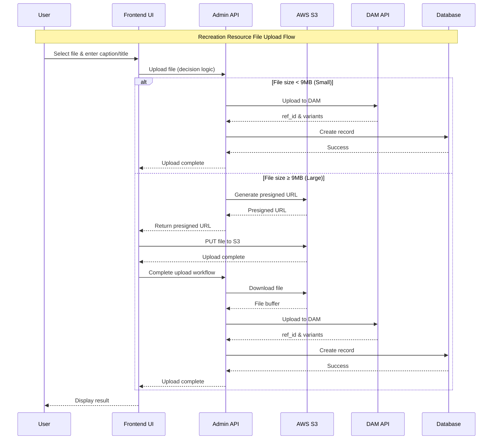

# Recreation Resource Upload Flow - Sequence Diagram

This diagram shows the complete flow for uploading files (images and documents)
to recreation resources, including the smart upload decision logic and both
upload paths.

## Flow Description

### Smart Upload Decision Logic

The system automatically chooses the optimal upload method based on file size:

- **Small Files (< 9MB)**: Use regular API Gateway upload (multipart/form-data)
- **Large Files (≥ 9MB)**: Use presigned S3 upload to bypass the 10MB API
  Gateway limit
- **Maximum File Size**: 100MB (enforced by presigned upload validation)

### Regular Upload Path (Small Files)

1. **Direct API Upload**: File sent directly to Admin API via
   multipart/form-data
2. **Immediate Processing**: API validates, uploads to DAM, and stores in
   database
3. **Simple Flow**: Single API call handles the entire workflow

### Presigned S3 Upload Path (Large Files)

#### Step 1: Get Presigned URL

- Frontend requests a presigned upload URL from Admin API
- Backend validates resource existence and file type
- S3 service generates a unique upload ID and presigned URL (1-hour expiry)
- Returns upload metadata to frontend

#### Step 2: Direct S3 Upload

- Frontend uploads file directly to S3 using presigned URL
- Progress tracking updates UI in real-time
- Bypasses API Gateway size limitations completely

#### Step 3: Complete Upload Workflow

- Frontend notifies Admin API that S3 upload is complete
- Backend downloads file from S3 temporary location
- File is processed through DAM (same as regular uploads)
- Database record created with file variants
- S3 temporary file is cleaned up

### Key Benefits

1. **🚀 No Size Limits**: Supports files up to 100MB (vs 10MB API Gateway limit)
2. **📊 Progress Tracking**: Real-time upload progress for large files
3. **🔄 Automatic Fallback**: Smart logic chooses optimal method
4. **🛡️ Error Handling**: Comprehensive retry logic for all failure scenarios
5. **🧹 Cleanup**: Automatic S3 temporary file cleanup
6. **⚡ Performance**: Direct S3 upload eliminates API Gateway bottleneck

### Error Handling

- **File Too Large**: Files > 100MB are rejected with clear error message
- **Upload Failures**: Any step failure shows error notification with retry
  option
- **Automatic Cleanup**: Failed uploads trigger S3 temporary file cleanup
- **Retry Logic**: Maintains same smart upload logic on retry attempts

### Technical Implementation

- **Frontend**: React hooks with TypeScript for type safety
- **Backend**: NestJS with clean architecture (Controllers → Services →
  Infrastructure)
- **Upload Strategy**: Strategy pattern with generic hooks for code reuse
- **Storage**: AWS S3 with presigned URLs for direct browser uploads
- **DAM Integration**: Digital Asset Management for file processing and variants
- **Database**: PostgreSQL with Prisma ORM for upload metadata
