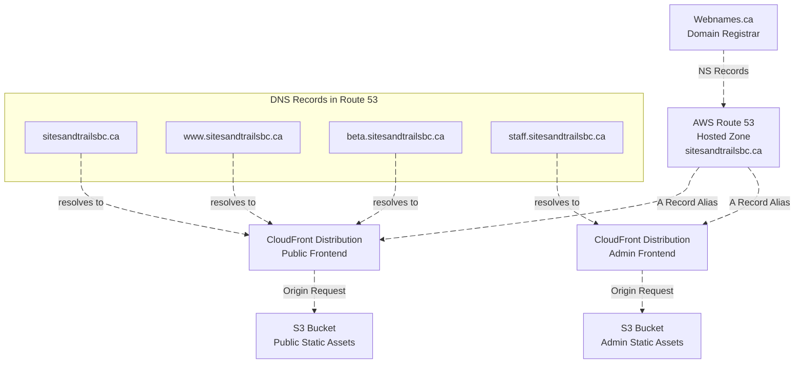

# DNS Setup Documentation

## Overview

This document describes the DNS configuration for the Recreation Sites and
Trails BC application suite, which includes both public-facing and
administrative applications hosted on AWS infrastructure.

## Domain Registration

- **Domain Name**: `sitesandtrailsbc.ca`
- **Registrar**: [Webnames.ca](https://webnames.ca)
- **Management**: The domain is managed by the CITZ Infrastructure Team

## DNS Infrastructure

### Route 53 Hosted Zone

The DNS is managed through **AWS Route 53**, which hosts the authoritative DNS
records for the domain. The hosted zone is created and managed via Terraform in
the [`infrastructure/dns`](../infrastructure/dns) directory.

**Key Configuration Files**:

- Infrastructure: [`infrastructure/dns/main.tf`](../infrastructure/dns/main.tf)
- Production Config:
  [`terraform/dns/prod/terragrunt.hcl`](../terraform/dns/prod/terragrunt.hcl)

### Delegation Setup

To delegate DNS authority from the domain registrar (Webnames.ca) to AWS Route
53:

1. A Route 53 hosted zone was created for `sitesandtrailsbc.ca`
2. Route 53 automatically generated four Name Server (NS) records
3. These NS records were provided to the CITZ Infrastructure Team
4. The CITZ team updated the NS records at Webnames.ca to point to AWS Route 53

This delegation allows all DNS records to be managed through Terraform and AWS
Route 53.

## DNS Records

The following DNS records are configured in Route 53:

### Public Frontend Records

| Record Type | Domain                     | Target                  | Purpose                             |
| ----------- | -------------------------- | ----------------------- | ----------------------------------- |
| A (Alias)   | `sitesandtrailsbc.ca`      | CloudFront Distribution | Apex domain for public site         |
| A (Alias)   | `www.sitesandtrailsbc.ca`  | CloudFront Distribution | WWW subdomain for public site       |
| A (Alias)   | `beta.sitesandtrailsbc.ca` | CloudFront Distribution | Beta/preview version of public site |

### Admin Frontend Records

| Record Type | Domain                      | Target                  | Purpose                  |
| ----------- | --------------------------- | ----------------------- | ------------------------ |
| A (Alias)   | `staff.sitesandtrailsbc.ca` | CloudFront Distribution | Administrative interface |

### Record Configuration Details

All frontend records are configured as **Route 53 Alias records** pointing to
CloudFront distributions:

- **Alias to CloudFront**: Uses the CloudFront hosted zone ID `Z2FDTNDATAQYW2`
  (AWS global constant)
- **Target**: CloudFront distribution domain names (e.g.,
  `d111111abcdef8.cloudfront.net`)

## SSL/TLS Certificates

### Certificate Management

SSL/TLS certificates are managed through **AWS Certificate Manager (ACM)**:

- **Certificate Type**: Wildcard certificate
- **Domains Covered**:
  - `*.sitesandtrailsbc.ca` (all subdomains)
  - `sitesandtrailsbc.ca` (apex domain)
- **Region**: `us-east-1` (required for CloudFront)
- **Validation Method**: DNS validation via CNAME records
- **Management**: **Manually created** (not managed by IaC)

### IaC Configuration

The certificate is **not managed** by Terraform. The infrastructure code only
**looks up** the existing certificate:

### Certificate Validation Process

The wildcard certificate was validated during initial setup:

1. Certificate was manually created in ACM Console (region: `us-east-1`)
   - This certifcate was created in us-east-1 because CloudFront requires
     certificates to be in that region
2. ACM generated CNAME validation records
3. These CNAME records were added to the Route 53 hosted zone.
4. ACM automatically validated and issued the certificate

## Architecture Overview



**Flow Description**:

1. **Domain Registrar** (Webnames.ca) delegates DNS to AWS Route 53 via NS
   records
2. **Route 53** maintains DNS records and routes traffic using A record aliases
3. **DNS Records** map custom domains to CloudFront distributions
4. **CloudFront** serves as CDN and fetches content from S3 origin buckets

**Components**:

- **Route 53 Hosted Zone**: Fully managed via Terraform
- **DNS Records (A records)**: Fully managed via Terraform
- **ACM Certificate**: **Not managed** by Terraform (manually created, only
  referenced via `data` source)

## Deployment Process

### Initial Setup (One-time)

1. **Create Route 53 Hosted Zone**:

   ```bash
   cd terraform/dns/prod
   terragrunt apply
   ```

2. **Retrieve Name Servers**:

   ```bash
   terragrunt output name_servers
   ```

   Example output:

   ```
   [
     "ns-123.awsdns-45.com",
     "ns-678.awsdns-90.net",
     "ns-1234.awsdns-56.org",
     "ns-5678.awsdns-12.co.uk"
   ]
   ```

3. **Coordinate with CITZ Infrastructure Team**:

   > The existing NS records were provided to the CITZ Infrastructure Team
   > during initial setup. For future reference, the process is as follows:

   - Provide the four name server records
   - Request update of NS records at Webnames.ca
   - Wait for DNS propagation (typically 4-6 hours)

4. **Verify DNS Delegation**:
   ```bash
   dig sitesandtrailsbc.ca NS
   nslookup -type=NS sitesandtrailsbc.ca
   ```

### Adding New Records

To add new DNS records:

1. Update [`infrastructure/dns/main.tf`](../infrastructure/dns/main.tf)
2. Add new `aws_route53_record` resources
3. CI/CD: GitHub Actions workflow will automatically apply changes to Route 53
4. Changes propagate automatically (no registrar coordination needed)

**Example**:

```terraform
resource "aws_route53_record" "new_subdomain" {
  zone_id = aws_route53_zone.main.zone_id
  name    = "subdomain.${var.domain_name}"
  type    = "A"

  alias {
    name                   = "target-cloudfront-domain.cloudfront.net"
    zone_id                = local.cloudfront_hosted_zone_id
    evaluate_target_health = false
  }
}
```

## Monitoring and Maintenance

### Certificate Renewal

ACM certificates with DNS validation **auto-renew automatically**:

- ACM checks for renewal 60 days before expiration
- DNS validation records remain in place
- No manual intervention required
- **Note**: The certificate is manually managed (not via IaC), but renewal is
  automatic through AWS ACM

### Verifying DNS Resolution

Use these commands to verify DNS is working correctly:

```bash
# Check A records
dig sitesandtrailsbc.ca A
dig www.sitesandtrailsbc.ca A
dig staff.sitesandtrailsbc.ca A

# Check from specific DNS server
dig @8.8.8.8 sitesandtrailsbc.ca

# Trace DNS resolution path
dig +trace sitesandtrailsbc.ca
```
